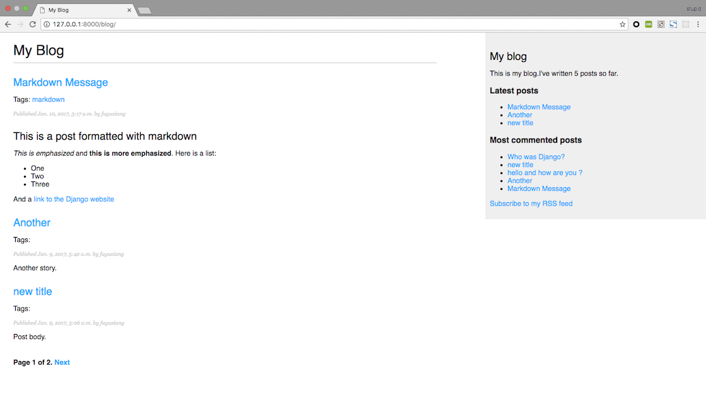
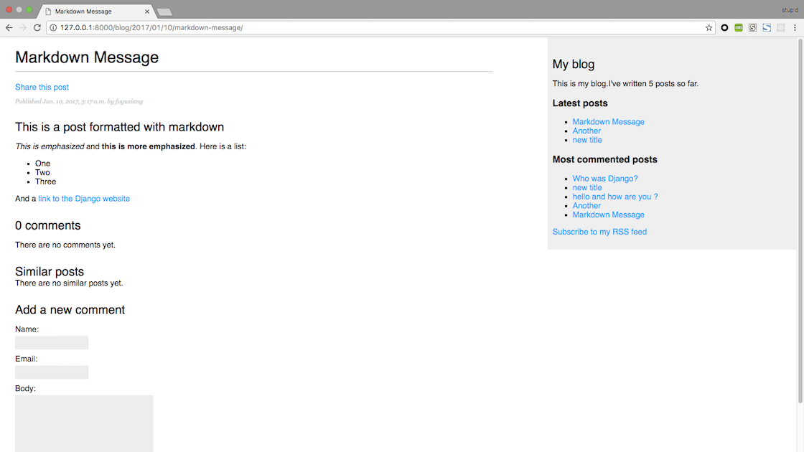

A simple blog

install requirements:

    $ pip install -r requirements.txt
    python manage.py makemigrations
    python manage.py migrate
    python manage.py runserver

Then open http://127.0.0.1:8000/blog/ with your browser.

Writing with Python 3.5

